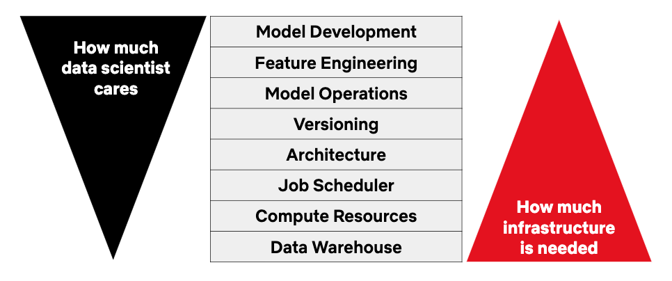

 

Ever worked on #machinelearning projects from development to production would realize the pipeline across several projects are repetitive and it’s dynamic for different machine learning problems such as features engineering,model selection, hyper parameters optimization, model evaluation, data augmentation,model threshold calibration, the entire training workflow and packages management during production.

Here Netflix comes to a rescue with Metaflow.org,
Netflix Metaflow promise data scientists high productivity by shorten the time spent on model development,feature engineering,model Operations,versioning,Architecture,Job scheduler,compute resources allocation and Data warehouse.
