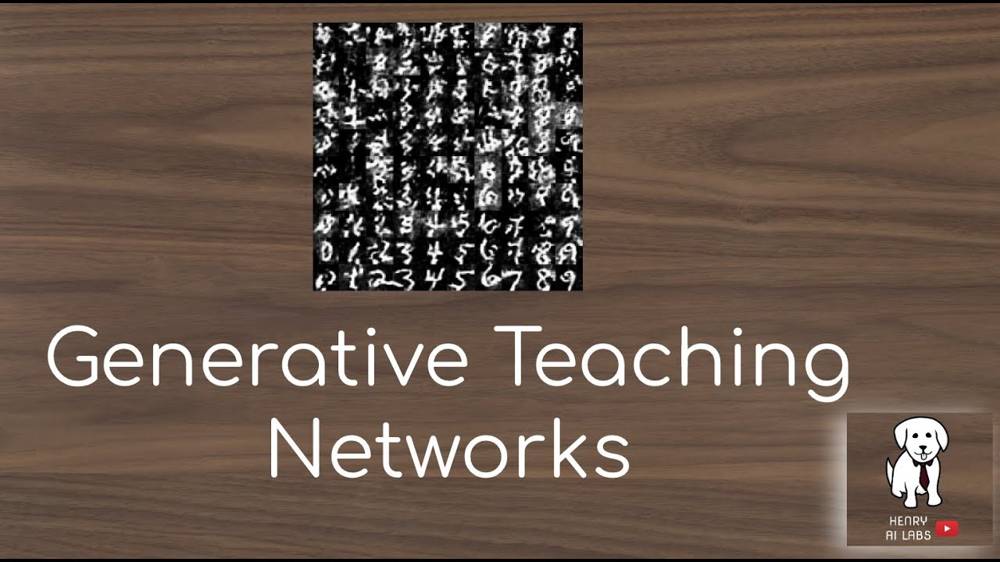

 

Learning is an Integral part of human cycle and is a continuous process.

The question I often ponder on is “it’s possible for people to be getting better at the wrong things” How can we learn and what should we learn is very crucial in today fast evolving Information Age.

Many fortunes 500 and 1000 spend a lot of resources on training new employees and yet the trained employee would not be at the level of the master and this is not a magic it’s just a bias we can’t do without .

Generative Teaching Network and meta learning is an exciting area of #machinelearning and #artificialintelligence I found Interesting recently which is a learning algorithm that automatically generate a training data, learning environment and curricula to help AI agent rapidly learn.

This would help create many learning problems and provide a solution to them real quick in an environment specific by searching for the right architecture using Neural Architecture Search.

https://lnkd.in/dAQvX3Q
