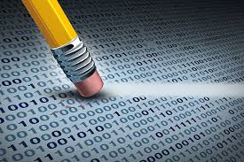

 

**GDPR** and other data privacy policies is something that needs to be revisited among the #deeplearning researchers.

We often talk about #machinelearning and we don’t quite discuss about _machine unlearning_, right to be forgotten” policies might actually pose more challenges that would cause many organizations to enforce their deployed models into production to unlearn suppose the key features the model learned from is revoked by the user.

Machine learning production deployment pipeline never considered unlearning strategy except they relied heavily on “batch retraining” which isn’t efficient for a large datasets and training time.

I found this paper interesting for anyone or organization planning to incorporate some unlearning strategies for their model.

https://lnkd.in/dXDPbcg
