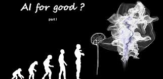

<!--  -->
 

**artificialintelligence** for social good, With the advent of GAN(Generative Adversarial Network) and DCGAN(deep convolutional GAN) many applications has sprouted out in recent time while some are anti social like #deepfake , Social Mapper is employing computer vision leveraging on #deeplearning to help cub cyber crimes in an efficient manner by searching for a target across all the social media for immediate Identification and not only that Deeplogger is also helping in the same domain to help identify cyber targets and has open source its source code for the community of enthusiasts to make more Innovation from.

“Technology is only a tool it all depends on how we use it that determine where our future as humanity lies .”
