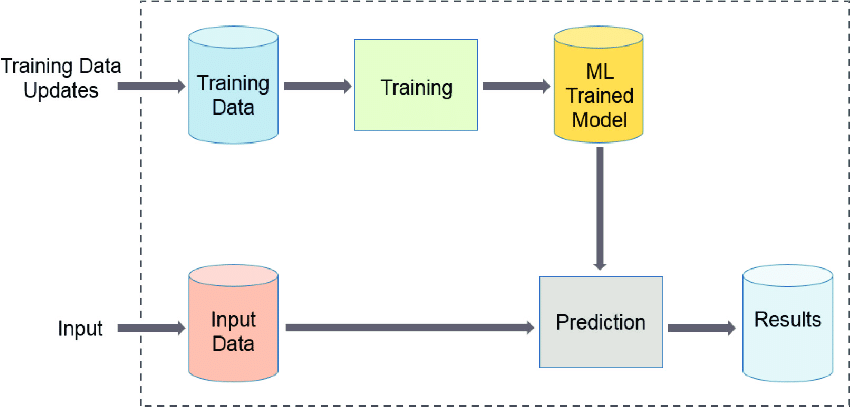

 

**Machine Learning workflow** Machine learning workflow are the series of steps required in executing a machine learning related tasks from concept to production deployment.

Below are some of the essential machine learning workflow;

- Input
  - data source 1
  - data source 2
- Data preprocessing
  - Database merge
  - Encoding categorical variable with one hot encoding and Label encoding.
  - Data scaling and Normalization
  - Imputing missing values
  - Train test split
- Data Exploratory Analysis
  - Data visualization
- Model Building
  - Model selection
  - Hyper parameter Tunning
  - Model Training
  - Model evaluation
- Output
  - Making predictions
  - Making recommendation
  - classification; Binary/categorical
