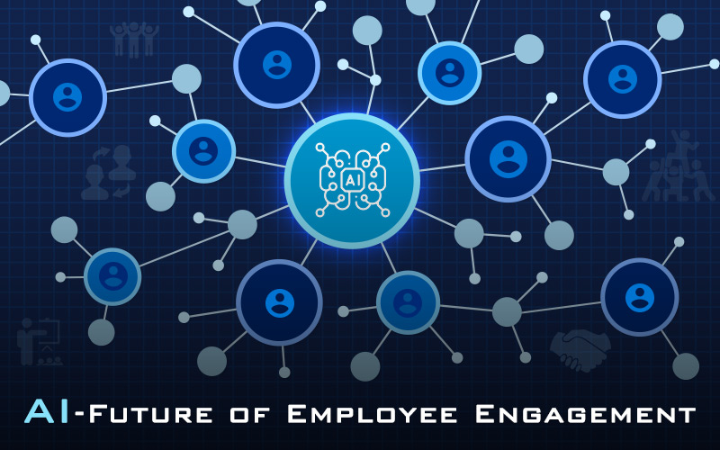

<br/>

**Artificial Inteeligence** and the Future of Employment Strategy:

Artifical Intelligence is one of the most innovative technologicl advacement and breakthrough of the modern time. From daily lives to cooperate cultures, everything is being impacted by the novel technology. AI strategy revamp business processby giving managers the power to analyze a vast amount of valuable data derived from employee.

## Some Ways AI can help hiring managers and HR managers in the organization.

- AI can better help the newly employee to the organization make a prdictive guess on what the salary of the newly employed staff should be based on some characteritics like _Years of experience_, _Age_, _Interview Score_ , _Location_, _Previous Employment patterns_, _Previous Positions Held_ etc. I did a good job of training a model and host to better have a glimpse of what AI can do in this context. [Click here](https://salaryforcast.herokuapp.com/) to experiment with it.
- Organizations are increasingly adopting AI technology to enhance employee engagement within the organization for better retentions and to better improve employee peformance and revamp productivity.
- AI can be used to help hiring managers write a compelling Job description based on the current situations and the mission of the organization rather than previous techniquee. In this way, better candiate that can drive the organization to achive the known misson would be demanded for.
- AI can help HR managers make a crtitical decisons on who is due for promotion within the work space and when to ensure the growth of the organization and Individual through analytics.
- _There would be more updates to the list please keep an eye for more updates to the list._

```
I work for TREPLABS an IoT and AI company solving some of the biggest healthcare challenges in Africa with the above technologies to ensure No one dies from diseases and Infections that could be cured with Technology.

You got an updates for me?? Reach out here: tafeez.tech@gmail.com || +2348101595909
```
