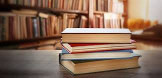

 

**Books I have read and learned some valuable things from**

- <strong>Focus the Hidden Driver of Excellence</strong> By Daniel Goleman
- <strong>The Strategy Book </strong> By Max Mckeown
- <strong> Why Great New Products Fail </strong> By Duncan Simester et-al
- <strong> Managing Innovation, Design and Creativity</strong> By Bettiva Von Stamm
- <strong>When: The Art of Perfect Timing</strong> By Stuart Albert
- <strong>The Innovation Book </strong> By Max McKeown
- <strong> The Art of Startup Fundraising </strong> By Alejandro Cremades
- <strong>Walk Like a Giant, Sell Like a Madman</strong> By Ralph R. Robert
- <strong>Managing Innovation: Integrating Technological, Market and Organizational Change, 5th Edition </strong> By John Bessant and Joe Tidd
- <strong>Sapeins A Brief History of Humankind</strong> By Yuval Noah Harari
- <strong> Good to Great</strong> By Jim collins
- <strong> Unfu\*k Yourself</strong> By Gary John Bisho
- <strong> All about love</strong> By bell hooks
- <strong>Art of communication</strong>
- <strong>Deep Learning Book </strong> By Ian Goodfellow et-al
- <strong>Generative Deep Learning</strong> By David Foster
- <strong> Practical Deep Learning for Cloud, Mobile and Edge</strong>
- <strong>7 Habits of Highly effective people </strong> by Stephen Corey
- <strong>Principle</strong> by Ray Dalio
- <strong>The New One Mnute Manager</strong> by Ken Blanchard
- <strong>Thinking Fast and Slow</strong> by Daniel Kahneman
  <strong></strong>
