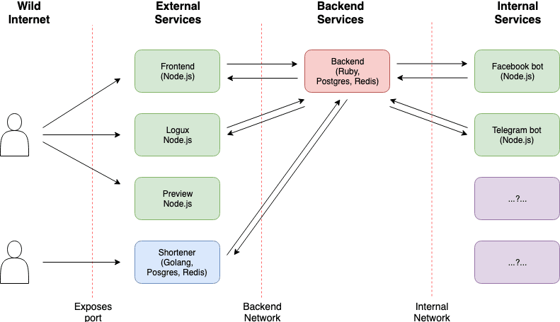

 
 
 

Building a multi-services multi-Node application with docker swarm. Container orchestration has made life easier and helps teams focus on which language can perform what area of an application the best rather than choosing one stack for the entire application. Before, teams have to some sort of coming to a compromise of which stack to base the entire application building on but docker swarm has made this type of solution easy and scalable with the multi-service multi-node features.

The team just need to focus on what tools can help deliver those specific features the best and leave orchestration to docker swarm. In a web application that needs more than five services to run where the Frontend is built with reacts/python, key-value store with Redis, worker processes for a queue with .Net frameworks, Database with PostgreSQL or NoSql(dynamo DB or MongoDb) and result from the application with NodeJS. A network overlay can be set up for all of these services to talk to each other.

Fortunately, there is a built-in load balancer in docker swarm overly network oppose to configuring an Elastic Load balancer in the case of AWS environment.-- this helps to handle traffic across each component of the application by configuring multiple replicas of each service. Container Cloud Infrastructure holds a promising future for robust and scalable application which will give developers the autonomy to choose what suit the best for a specific application features. And help business focus on delivering features quickly to users to stay relevant in this disrupting world of business with new techniques.
