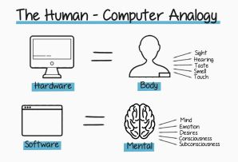

 
 
 

Mobile Devices and Personal PCs are as useless as anything if there are no software updates. A human body is somehow useless if there are no updates in our ideology, philosophies about life, ourself and other people around us. And more importantly, our perception of what success is and the process of achieving our goals and dreams.

Sitting in the middle of the night and seeing myself as a mobile device— my brain is my software which needs constant features updates and OS versions. There have to be some reasons why we need constant updates to stay relevant and much appealing to ourself and many other people around us.

We, humans, have to be constantly updating our software (brain) on multiple things and adding new features and security patches with good UI(because appearance tells how people should address us)— this is how we can be valuable to different users and stay relevant as time passes by.

Our goal as a human is to constantly update ourselves on multiple things and if we are not constantly contradicting ourself, we are not growing.
