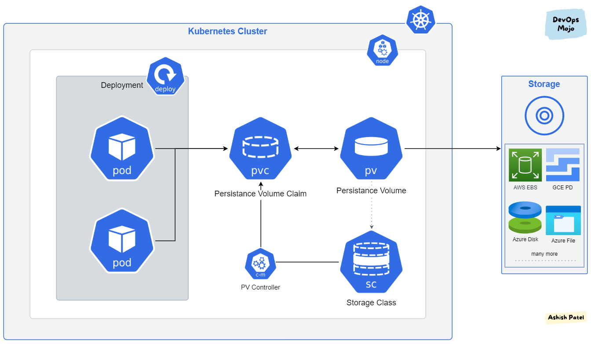

<br/>
<br/>
<br/>


**Steps to getting kubernetes persistent storage working in Your EKS Cluster with EFS provisioner using Terraform and Helm**

Note: Some level of working with kubernetes, terraform, AWS and Helm is required

Prerequisites:

Every major data systems such as kafka, redis, mysql, postgresql, elasticsearch, prometheus and many more data systems which requires to store long lived data for workloads that interact with them beyond the lifecycle of the container that created it need some form of persistent storage

And to achieve that objective of storing data beyond the containers that created it, a special object in kubernetes is required to achieve this, which is mostly reffered to as __Statefulset__ but persistent volumes can also be created for __Deployment__ containers.

However, deploying a statefulset workloads requires a singleton pattern-either out-of-locking or in-app locking--a seperate post is comming on this in this series of storage on kubernetes

## Types of Volumes in kubernetes

There are various types of mechanisms to achieve storage on kubernetes depending on the intent and architecture requirements of the application.

The emptyDir() to mention a few--which is very close to a persistent volume in the sence that it persist container restarts--meaning restarting a container multiple times intact the data it stored

## Implementation Stage1:

Installation of EFS Storage Driver on EKS EC2 node groups-- This wil install the efs-csi-controller and the efs-csi-node on each of the cluster node groups 

The controller service is responsible for managing the creation and deletion of volumes in the storage provider—taking volume snapshots and expanding volume etc

While the efs-csi-node control volume requests and managements for workloads on each node

Code Implementation

Step1: EFS [IAM Policy](https://raw.githubusercontent.com/kubernetes-sigs/aws-efs-csi-driver/v1.3.2/docs/iam-policy-example.json) creation

```
resource "aws_iam_policy" "efs_provisioner" {
  name        = "efs-provisioner-iam-policy"
  description = "IAM Policy for the AWS EFS provisioner as Persistence Volume source"
  policy      = file("efs_driver_iam_policy.json")
}
```

Step 2: Create an IAM role for EFS permission--principle of least priviledges
```

module "efs_provisioner" {
  source  = "terraform-aws-modules/iam/aws//modules/iam-assumable-role-with-oidc"
  version = "~> 4.0"

  create_role = true
  role_name   = "efs-provisioner-${local.cluster_name}"
  provider_url = replace(flatten(concat(data.aws_eks_cluster.cluster[*].identity[*].oidc.0.issuer, [
  ""]))[0], "https://", "")
  role_policy_arns = [
  aws_iam_policy.efs_provisioner.arn]
  oidc_fully_qualified_subjects = [
  "system:serviceaccount:kube-system:efs-provisioner"] #namespace:serviceaccountname
  oidc_fully_qualified_audiences = [
    "sts.amazonaws.com"
  ]
}
```

Step3: Create a service account for IAM and annotate it with the iam role arn created above
```
resource "kubernetes_service_account" "efs_provisioner" {
  metadata {
    name      = "efs-provisioner"
    namespace = "kube-system"
    annotations = {
      "eks.amazonaws.com/role-arn" = module.efs_provisioner.iam_role_arn
    }
  }
  depends_on = [module.efs_provisioner]
}
```


step 4: Configure the controller via its helm value
```
controller:
  create: true
  serviceAccount:
    create: false
    name: efs-provisioner
  resources:
    limits:
      cpu: 100m
      memory: 128Mi
    requests:
      cpu: 100m
      memory: 128Mi
  heathPort: 9909
```


Step 5: Create the helm release for the driver
```
resource "helm_release" "efs_provisioner" {
  name       = "efs-provisioner"
  chart      = "aws-efs-csi-driver"
  namespace  = "kube-system"
  repository = "https://kubernetes-sigs.github.io/aws-efs-csi-driver/"
  timeout    = "1500"

  # configuration settings
  values = [local.efs_provisioner_config]
}
```


</br>

## Stage2: Creation of EFS Filesystem Storage device with terraform

</br>
A Storage device could be a filesystem or a block-level storage class. The two major storage device used on AWS are the EBS volumes for block-level storage and EFS and Fsx for filesystem storage. 

EBS volumes usally comes with EC2 node groups with default gp2 storage classs. But in this we'll be considering a special case where an elastic filesystem is required for some data intensive workloads that might might need to live beyond the lifecyle of the container pod that created the data for analytics or other business decisions

Step1: Creating the Filesystem
```
resource "aws_efs_file_system" "sample_app_file_system" {
  encrypted        = true
  performance_mode = "generalPurpose"
  throughput_mode  = "bursting"
}
```

Step2:  Create a mount target on all the private subnets for the filesystem

```
resource "aws_efs_mount_target" "sample_efs_target" {
  count = length(module.vpc.private_subnets)

  file_system_id  = aws_efs_file_system.sample_app_file_system.id
  security_groups = [aws_security_group.efs_sg.id]
  subnet_id       = module.vpc.private_subnets[count.index]
  depends_on = [
    module.vpc
  ]
}
```
Step3: create access point
```
resource "aws_efs_access_point" "sample_fs_access_point" {
  count          = var.server_nodes
  file_system_id = aws_efs_file_system.sample_app_file_system.id

  root_directory {
    path = "/server${count.index}"
    creation_info {
      owner_gid   = 1000
      owner_uid   = 100
      permissions = "0755"
    }
  }

  posix_user {
    gid = 1000
    uid = 100
  }
  depends_on = [
    module.vpc
  ]
}
```

Step4: Create Security group for the access point to allow NFS Ingress to the filesystem

```
resource "aws_security_group" "efs_sg" {
  name        = "sample-app-efs-sg"
  description = "allow inbound access from NFS protocol to the Filesystem"
  vpc_id      = module.vpc.vpc_id
  ingress {
    protocol    = "tcp"
    from_port   = 2049
    to_port     = 2049
    cidr_blocks = [module.vpc.vpc_cidr_block]
  }
  egress {
    protocol    = "-1"
    from_port   = 0
    to_port     = 0
    cidr_blocks = [module.vpc.vpc_cidr_block]
  }
  depends_on = [
    module.vpc
  ]
}
```
</br>

## Stage3: Creating Storage Class with the created EFS Storage device

```
kind: StorageClass
apiVersion: storage.k8s.io/v1
metadata:
  name: efs-sc
provisioner: efs.csi.aws.com
parameters:
  provisioningMode: efs-ap
  fileSystemId: ${created_efs_file_system_id}
  directoryPerms: "700"
  gidRangeStart: "1000" # optional
  gidRangeEnd: "2000" # optional
  basePath: "/dynamic_provisioning" # optional
```

## Stage4: Creation of Persistent Volume from the Storage Class

Persistence volume is basically a place holder for storage requests
```

apiVersion: v1
kind: PersistentVolume
metadata:
  name: efs-pv
spec:
  capacity:
    storage: 100Gi
  volumeMode: Filesystem
  accessModes:
    - ReadWriteOnce
  persistentVolumeReclaimPolicy: Retain
  storageClassName: efs-sc
  csi:
    driver: efs.csi.aws.com
    volumeHandle: ${created_efs_file_system_id}
```

</br>

## Stage5: Create Persistent Volume Claims for workloads to use
```
apiVersion: v1
kind: PersistentVolumeClaim
metadata:
  name: sample-app-pvc
spec:
  accessModes:
    - ReadWriteOnce
  storageClassName: efs-sc
  resources:
    requests:
      storage: 5Gi
```

## Stage6: Attaching a Persistence Volume Claims to workload

```
apiVersion: apps/v1
kind: Deployment
metadata:
  name:
  labels:
    name:
spec:
  replicas: 1 
  selector:
    matchLabels:
      name:
  template:
    metadata:
      labels:
        name:
    spec:
      containers:
        - name:
          image: 
          resources:
            limits:
              memory: 600Mi
              cpu: 500m
            requests:
              memory: 300Mi
              cpu: 50m
          imagePullPolicy: Always
          command:
          ports:
            - containerPort: 8080
          livenessProbe:
            httpGet:
              path: /
              port: 8080
              httpHeaders:
              - name: status
                value: healthy
            initialDelaySeconds: 60
            periodSeconds: 60
          volumeMounts:
            - name: sample-app-pvc
              mountPath: /data
      volumes:
      - name: sample-app-pvc
        persistenceVolumeClaim:
          clainName: sample-app-pvc
```

**Hope It Helps**
