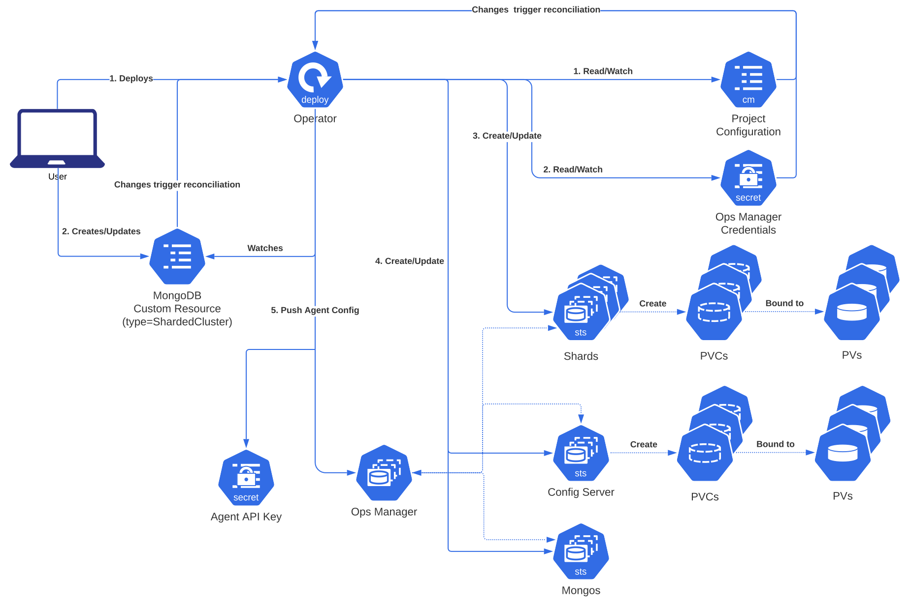
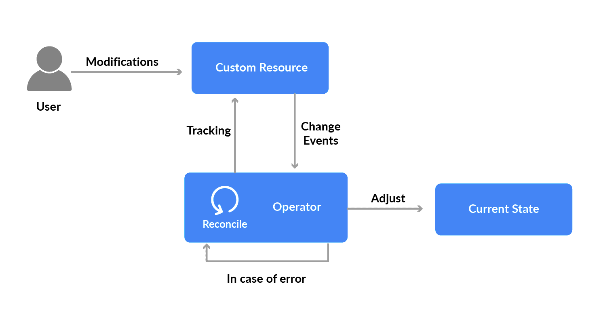

<!--  -->
<br/>
<br/>
<br/>

## Prerequisites

Kubernetes is known to be a [declarative](https://kubernetes.io/docs/tasks/manage-kubernetes-objects/declarative-config/) platform as opposed to imperative; meaning: you don't need to specify the sequence and logics of how things should work, you just need to declare the end result expected(desired state) you want the resources to be and kubernetes will try to make that happen and maintain that state for that resource

For kubernetes to maintain that state for your resource, what does that is called a controller

## Controllers and Native Objects

<br/>


Controller is a kuberentes component that maintain(control) the desired state for native [kubernetes objects](https://kubernetes.io/docs/concepts/overview/working-with-objects/kubernetes-objects/) such as: Deployment, Statefulset, ReplicaSet(managed by ReplicationController), Secrets, ConfigMap, PersistentVolume etc


## Kubernetes Operators and CRDs

<br/>


[Operators](https://kubernetes.io/docs/concepts/extend-kubernetes/operator/) on the other hand control(maintain) Custom Resource Definitions(CRDs) desire states--where Custom Resources are provided by third party applications such as:

- certmanager
- prometheus-grafana and alertmanager
- confluent platform comonents
- Elastic 

_Note:_ Each third-party applications mentioned above and others will provide the CRDs and the Operators to maintain their CRDs in their Instllation guide

How it works: When you install the helm chart for an [operator](https://operatorhub.io/), It'll Install both the CRDs and the Operators for that Application

For example:

Helm installation of [cert-manager](https://artifacthub.io/packages/helm/appscode/cert-manager-crds) will install the cert-manager CRDs:
```
Certificate
Issuer
ClusterIssuer
CertificateRequest
```

Helm installation of [kube-stack-prometheus](https://artifacthub.io/packages/helm/prometheus-community/kube-prometheus-stack) will install Prometheus, Grafana and Alertmanager CRDs:
```
Probe
ServiceMonitor
AlertManager
AlertManagerConfig
Prometheus
ThanosRuler
etc
```

Helm installation of [confluent components](https://docs.confluent.io/operator/current/co-deploy-cfk.html) platform will install Zookerper, Kafka, KsqlDB, Connect, SchemaRegistry CRDs:
```
Zookeeper
Zookeeper
Kafka
Connect
KsqlDB
Controlcenter
SchemaRegistry 
```

Helm installation of Elastic will install Elastic Search, Kibana, Filebeat and other Elastic components CRDs:
```
ElasticSearck
Kibana
Filebeat
etc
```
Helm installation of [loki-stack](https://grafana.com/docs/loki/latest/installation/helm/) will install [Grafana Loki](https://grafana.com/oss/loki/), [LokiPromtail](https://grafana.com/docs/loki/latest/clients/promtail/), [FluentD](https://www.fluentd.org/), [FluentBit](https://fluentbit.io/) etc

__Note:__ There's a a [diffence](https://logz.io/blog/fluentd-vs-fluent-bit/) in the architecture of FlentBit and Fluentd

Other Operators I have had experience working woth Includes:
- [Traefik](https://github.com/traefik/traefik-helm-chart)
- AWS [Application LoabBalancer Controler](https://artifacthub.io/packages/helm/aws/aws-load-balancer-controller) 


I hope it helps