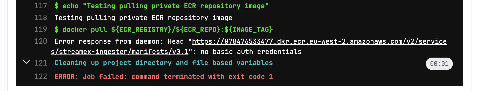
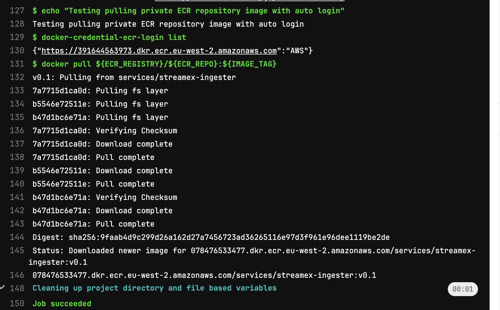

<!--  -->
<br/>
<br/>
<br/>

## **Simplifying Gitlab Self-Hosted Runner Integration with AWS Elastic Container Registry(ECR)**

- [Topic](#topic)
- [Options Considered](#options-considered)
- [Option Recommended](#option-recommended)
- [Baking ECR Helper into Gitlab Runner Kubernetes Executor](#baking-ecr-helper-into-gitlab-runner-kubernetes-executor)
  - [Build the helper Image](#build-the-helper-image)
  - [Configure the credential helpers](#configure-the-credential-helpers)
  - [Override the runner helm chart values](#override-the-runner-helm-chart-values)
- [Issues and Considerations](#issues-and-considerations)
- [Conclusion](#conclusion)


## Topic

Auto Authenticate to AWS ECR with Self-Hosted Gitlab Runner on Kubernetes.

When pulling an image from a private AWS ECR repository using the gitlab kubernetes Executor with Docker in Docker(DinD), the kubernetes Executor using DinD needs to be `authenticated` to the private AWS ECR repository so that it can pull the image from the registry.

```yml
ecr_pull_image:
  stage: build
  variables:
    ECR_REGISTRY: 078476533477.dkr.ecr.eu-west-2.amazonaws.com
    AWS_REGION: eu-west-2
    ECR_REPO: services/streamex-ingester
    IMAGE_TAG: v0.1
  script:
    - echo "Testing pulling private ECR repository image"
    - docker pull ${ECR_REGISTRY}/${ECR_REPO}:${IMAGE_TAG}
```


## Options Considered

* Use Docker login command 

In this approach, a docker command line is used each time the pipeline runs and `ecr_pull_image` job executes to get authentication credentials to ECR

```yml
ecr_pull_image:
  stage: build
  variables:
    ECR_REGISTRY: 078476533477.dkr.ecr.eu-west-2.amazonaws.com
    AWS_REGION: eu-west-2
    ECR_REPO: services/streamex-ingester
    IMAGE_TAG: v0.1
  script:
    - aws ecr get-login-password | docker login --username AWS --password-stdin ${ECR_REGISTRY}
    - docker pull ${ECR_REGISTRY}/${ECR_REPO}:${IMAGE_TAG}
```

* Use [AWS ECR Helper](https://github.com/awslabs/amazon-ecr-credential-helper) binary to auto-login and get credentials.

In this approach we've [added an extra binary to the runner base image](#baking-ecr-helper-into-gitlab-runner-kubernetes-executor) that automatically logged in to ECR before pulling the image, 

```yml
ecr_pull_image:
  stage: build
  variables:
    ECR_REGISTRY: 078476533477.dkr.ecr.eu-west-2.amazonaws.com
    AWS_REGION: eu-west-2
    ECR_REPO: services/streamex-ingester
    IMAGE_TAG: v0.1
  script:
    - echo "Testing pulling private ECR repository image with auto login"
    - docker-credential-ecr-login list
    - docker pull ${ECR_REGISTRY}/${ECR_REPO}:${IMAGE_TAG}
```



## Option Recommended

The recommend solution is with the [ecr auto login helper](#use-aws-ecr-helper-binary-to-take-care-of-the-login) because teams(users of the pipelines runner) don't have to worry about extra steps in their pipelines `.gitlab-ci.yml` files to authenticate to ecr as this is already simplified and abstracted at the platform layer.

## Issues and Considerations

A [AWS Master Account](https://aws.amazon.com/blogs/containers/sharing-amazon-ecr-repositories-with-multiple-accounts-using-aws-organizations/) is assumed to be the central registry where all images are pushed to and is expected to [trust all child accounts](https://docs.aws.amazon.com/AmazonECR/latest/userguide/repository-policy-examples.html#IAM_allow_other_accounts) where imags are possible to be pulled from. 

If you have a dedicated AWS child account which you created and deploy the kubernetes and its networking connectity to (which is highly recommened) for your sef-hosted runner, the ECR registry must trust this account.

A proper [IRSA](https://docs.aws.amazon.com/eks/latest/userguide/iam-roles-for-service-accounts.html) must be configured for gitlab runner pod to access AWS, the IRSA is the runner instant profile and it must have enough permissions to the ECR repos it may possibly pull over the pipeline otherwise, things may not work if all these considerations are not in place.

## Baking ECR Helper into Gitlab Runner Kubernetes Executor

The Gitlab runner kubernetes executor provides a [helm chart](https://docs.gitlab.com/runner/install/kubernetes.html) to deploy the executor onto your cluster(EKS, GKE, AKS, Openshift etc) and to abstract some functionality away to the platform layer such as docker cli , aws, kubectl, helm etc. All these can be baked in into what gitlab called [helper image](https://docs.gitlab.com/runner/configuration/advanced-configuration.html#helper-image-configuration-for-kubernetes-on-arm).

### Build the helper Image

You can extend the helper image and baked in extra functionality into it and use in your helm chart values used to boostrap your runners.

```Dockerfile
FROM alpine:3.15

ENV ECR_HELPER_VERSION=0.7.0 \
    TARGET_OS=linux \
    TARGETARCH=amd64

RUN apk --no-cache add \
    openssl \
    bash \
    jq \
    docker \
    docker-cli \
    docker-cli-compose \
    make \
    curl 

# ECR Auto-Login Baked In
RUN curl -sL https://amazon-ecr-credential-helper-releases.s3.us-east-2.amazonaws.com/${ECR_HELPER_VERSION}/${TARGET_OS}-${TARGETARCH}/docker-credential-ecr-login -o /tmp/docker-credential-ecr-login-${TARGET_OS}-${TARGETARCH}

RUN mv /tmp/docker-credential-ecr-login-${TARGET_OS}-${TARGETARCH} /usr/bin/docker-credential-ecr-login \
    && chmod a+x /usr/bin/docker-credential-ecr-login

ENV PATH="/home/cliuser/.local/bin:${PATH}"
ENV PATH="/usr/local/bin:${PATH}"
```

### Configure the credential helpers

There is a json config below which needs to be exported into  `~/.docker/config.json`.
This can be achieved with the combination of pre build script and environment variables; just marshall the json config content to string and use the pre build script to export it to the `~/.docker/config.json`. Please read the [gitlab advanced config](https://docs.gitlab.com/runner/configuration/advanced-configuration.html#the-runners-section) docs carefully on this.

```json
{
    "credsStore": "ecr-login",
    "credHelpers": {
        "public.ecr.awss": "ecr-login",
        "<your_master_aws_account_where_ecr_image_comes_from>.dkr.ecr.eu-west-2.amazonaws.com": "ecr-login"
    }
}
```

### Override the runner helm chart values

Use the custom built helper image as the helper image key value in the `toml` and the marshalled json value for the value of `DOCKER_AUTH_CONFIG` variable in your chart values override [helm chart values](https://gitlab.com/gitlab-org/charts/gitlab-runner/-/blob/main/values.yaml)

```toml
  config: |
    [[runners]]
      environment = ["DOCKER_HOST=tcp://docker:2375", "DOCKER_TLS_CERTDIR=", "DOCKER_AUTH_CONFIG=${DOCKER_AUTH_CONFIG}"]
      pre_build_script = "${PRE_BUILD_SCRIPT}"
      [runners.kubernetes]
        namespace = "${NAMESPACE}"
        helper_image = "<custom_built_base_image_here>"
        [[runners.kubernetes.services]]
          alias = "docker"
          name = "docker-dind:v20.10.21-dind"
```

## Conclusion

W've hopefully simplified authentication to ECR over pipeline by baking some extra functionality into the platform to make things little more easier.