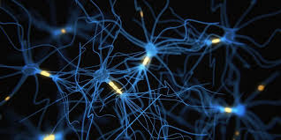

 

I read Thinking fast and Slow by Daniel Kahneman few months ago and Blink by Malcom Gladwell.

It’s really exciting when I listened to Yoshua Bengio Topic on moving from System 1 to system 2 deep learning.

Consciousness is what makes us human and our emotional readiness in all instances.

Truly there’s a bias in human thinking if we go by system 1 and following Malcom there’s no bias in Systems 1 because It’s often difficult to explain some things brain generalized on at times because it’s from Intuition and intuition is the accumulation of many knowledge points over a certain period of time.

System one would be accurate in as much as it’s short if where it’s generalizing from is quality and large enough (the knowledge points).

When I later read “The Art of Thinking clearly” by Rolf Dobelli I realized we should not use the length of time something takes as the metric to judge its accuracy. It’s all about Brain Bias.

Kindly watch Professor Yoshua video Here: https://lnkd.in/d6-f_ka
