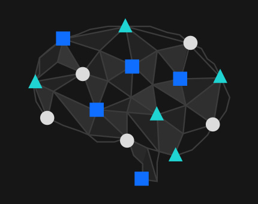

 

Learning by doing is the best approach to learn anything in this century, I have seen many people that want to jumpstart into developing #deeplearning models for different applications and one of the potential barriers to entry is data.

Without data one can pretty do nothing in the #artificialintelligence revolution, data is the power house.

As part of my commitment to share useful tools and resources with the community and contribute massively to open source from now on kindly check this link for list of open source data in many domain areas https://lnkd.in/dn9H4H8

I’ll also share a repo consist of many practical deep learning model for both beginners and Intermediate to do hands practice and apply AI in areas of their choice after some knowledge level by January, stay tuned and follow me for subsequent updates.
