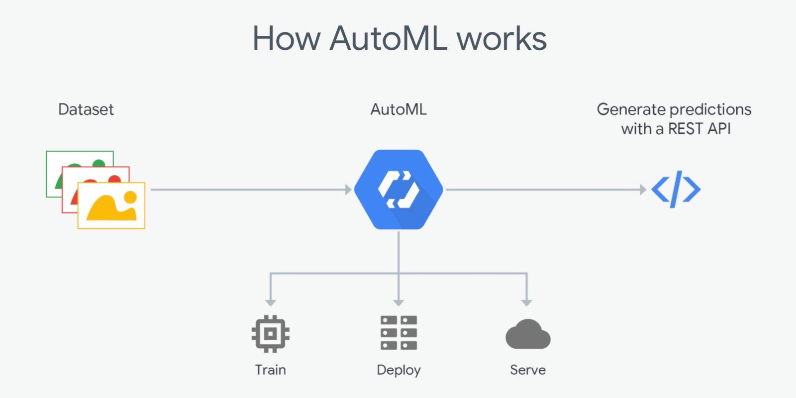

 

Automated Machine learning known as AutoML; I have seen many people with high domain expertise and little Algorithm knowledge who wanted to implement some machine learning in their organization.

AutoML is very handy for anyone and the main purpose is to automate some Machine learning pipeline process such as model selection, it uses Neural Architecture search to find the best model for that particular task and also helps with hyper parameters tuning.

Check out some AutoML solutions.
Google automl, Keras AutoML, sklearn AutoML H20.ai etc.
