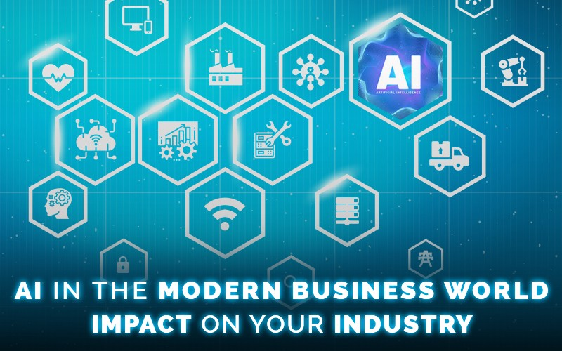

 

Much like the rise of electricity, which started about 100 years ago, AI will revolutionize every major industry.

A Traditional company + machine learning or some Neural Networks is not equal to an AI company.
An AI company is much deeper than that.
